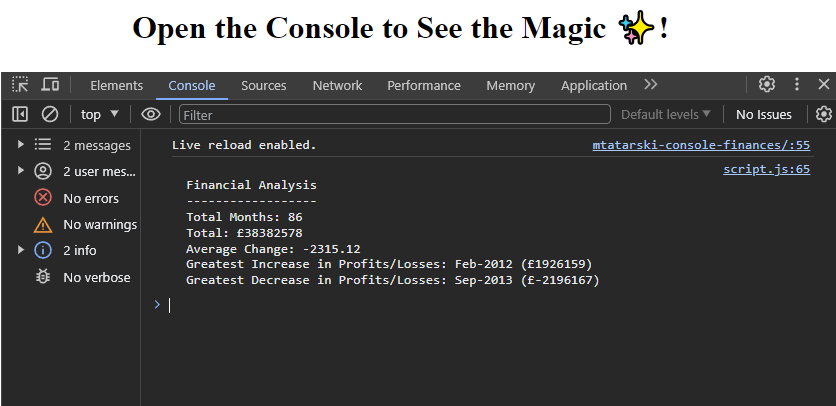
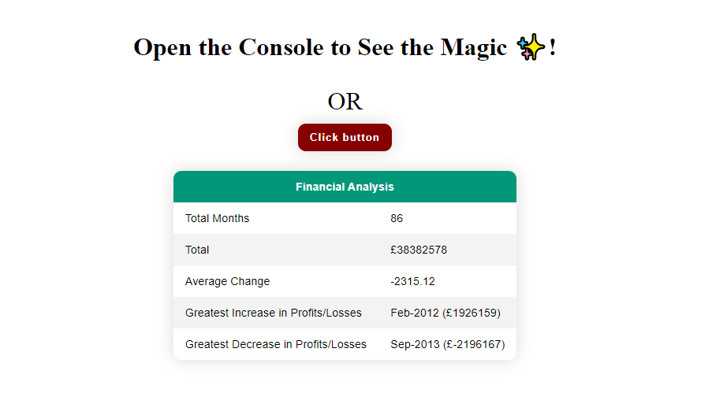

# Marcin Tatarski - Console/Browser Finances

## Overview

Explore Console Finances, a JavaScript tool designed for quick financial analysis. This application provides valuable insights into your financial records, presenting key metrics such as the total number of months, net total amount of Profit/Losses, average changes in Profit/Losses, and the greatest increase and decrease in Profit/Losses over the entire period.

## Screenshots

*View financial analysis directly in your console.*

*Access the same information with a user-friendly interface in your web browser.*

## How to Use

1. **Visit GitHub Pages:**
   - Simply navigate to the [GitHub Pages link](https://martindocs.github.io/mtatarski-console-finances) to experience the financial analysis directly in your web browser.

2. **Understand the Data:**
   - The data includes dates and profits or losses.

3. **Interact with the Analysis:**
   - After opening, use the browser's developer tools (inspect) to view the financial analysis in the console.
   - You can also use the button in a web browser to view and interact with the same data.

## Credits

N/A (No contributors at this time).

## License

Please refer to the [LICENSE](./LICENSE.md) file in this repository for details on how this project is licensed.
